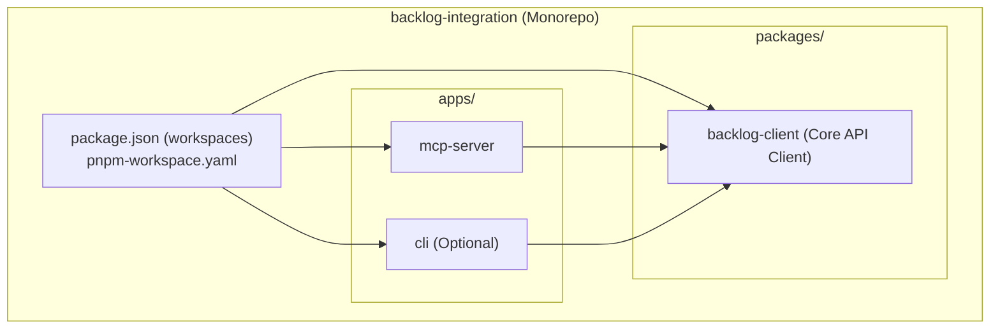
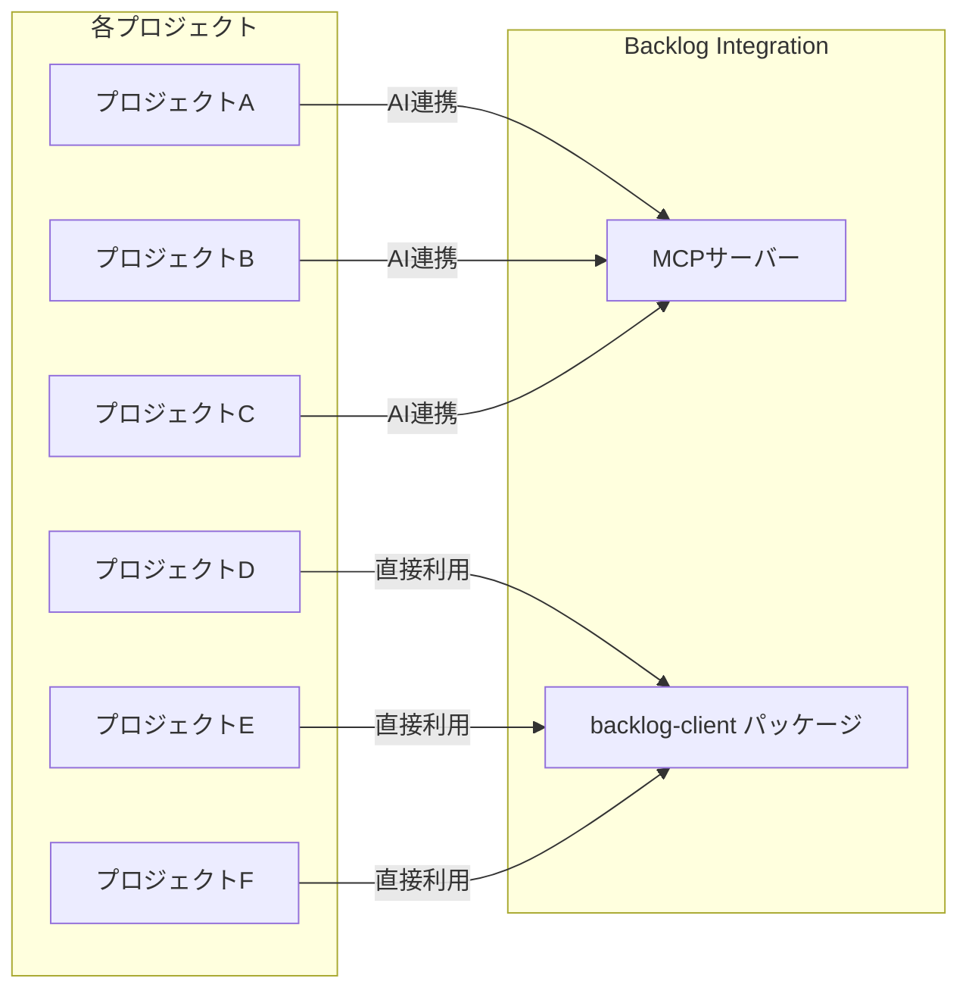

# 複数プロジェクトからBacklog連携を共通利用するためのアーキテクチャ設計

## 要件の整理

やりたいこと:

- BacklogからIssue（課題）を取得する
- 対応コメントを記載する
- レポーターへのアサイン変更を行う

これらを**複数のプロジェクト**から効率よく共通利用したい。

---

## アプローチ比較

| アプローチ | 概要 | メリット | デメリット | 推奨度 |
| :--- | :--- | :--- | :--- | :--- |
| **A. 共有npmパッケージ** | Backlog APIラッパーを独立パッケージとして切り出し、各プロジェクトが依存として利用 | バージョン管理が明確、言語非依存に近い | パッケージ公開・更新の手間 | ★★★★ |
| **B. モノレポ + Workspaces** | 全プロジェクトを1つのリポジトリに集約し、共通パッケージとして内部参照 | ローカル開発が楽、一括リファクタリング可能 | リポジトリが大きくなる、全プロジェクトが同一リポジトリ前提 | ★★★ |
| **C. MCPサーバー** | Backlog連携をMCPサーバーとして実装し、AIエージェント経由で全プロジェクトから利用 | AIワークフローとの統合が自然、プロジェクト側のコード変更不要 | MCPサーバーの運用が必要、プログラムからの直接呼び出しには不向き | ★★★★★ |
| **D. CLIツール** | Backlog操作をCLIツールとして実装し、各プロジェクトのスクリプトから呼び出す | シンプル、言語非依存 | GUI操作が必要な場合に不向き | ★★★ |
| **E. Git Submodule** | 共通コードをサブモジュールとして各プロジェクトに取り込む | 独立リポジトリのまま共有可能 | サブモジュール管理が煩雑 | ★★ |

---

## 推奨構成: ハイブリッド（MCPサーバー + 共有パッケージ）

最も効率的なのは、**用途に応じた2層構成**です。

### 構成図



各プロジェクトからの利用パターン:



---

## 各層の役割

### 1. `backlog-client`（コアパッケージ）

Backlog API v2のラッパーとして、以下の機能を提供:

```typescript
// 使用例
import { BacklogClient } from '@your-org/backlog-client';

const client = new BacklogClient({
  spaceId: 'your-space',
  apiKey: process.env.BACKLOG_API_KEY,
});

// 課題取得
const issue = await client.issues.get('PROJECT-123');

// コメント追加
await client.issues.addComment('PROJECT-123', {
  content: '対応しました。',
});

// 担当者をレポーターに変更
await client.issues.assignToReporter('PROJECT-123');
```

> [!TIP]
> Nulab公式の [`backlog-js`](https://www.npmjs.com/package/backlog-js) パッケージを内部で利用することで、APIの詳細を意識せずに済みます。

### 2. MCPサーバー

AIエージェント（Claude Desktop、Cursor、Cline等）から呼び出せるよう、MCPプロトコルでBacklog操作をツールとして公開:

| ツール名 | 説明 | パラメータ |
| :--- | :--- | :--- |
| `get_issue` | 課題の詳細を取得 | `issueIdOrKey` |
| `add_comment` | 課題にコメントを追加 | `issueIdOrKey`, `content` |
| `assign_to_reporter` | 担当者をレポーターに変更 | `issueIdOrKey` |
| `list_issues` | プロジェクトの課題一覧を取得 | `projectIdOrKey`, `statusId[]`, `assigneeId[]` 等 |

> [!NOTE]
> 既存の [`nulab-backlog-mcp-server`](https://github.com/nulab/backlog-mcp-server) が公式で存在しますが、担当者をレポーターに変更するような複合操作は未対応の可能性があります。自前実装と公式MCPサーバーの併用も検討してください。

---

## 設定の共通化

各プロジェクトで異なるのは**BacklogのプロジェクトキーとspaceId**のみです。  
これを環境変数で管理することで、コードの変更なしに複数プロジェクトで利用可能にします。

```bash
# .env（各プロジェクトごとに配置）
BACKLOG_SPACE_ID=your-space
BACKLOG_API_KEY=your-api-key
BACKLOG_PROJECT_KEY=PROJECT_A
```

MCPサーバーの場合は、`mcp_settings.json`（または各ツールの設定ファイル）に設定:

```json
{
  "mcpServers": {
    "backlog": {
      "command": "npx",
      "args": ["-y", "@your-org/backlog-mcp-server"],
      "env": {
        "BACKLOG_SPACE_ID": "your-space",
        "BACKLOG_API_KEY": "your-api-key"
      }
    }
  }
}
```

> [!IMPORTANT]
> `BACKLOG_PROJECT_KEY` はMCPツールのパラメータとして毎回渡す設計にすると、1つのMCPサーバーインスタンスで複数プロジェクトを操作できます。

---

## どのアプローチを選ぶべきか？

### AIエージェントを活用する場合 → **MCPサーバー**

- Cursor / Claude Desktop / Cline などのAIエージェントから自然言語でBacklog操作ができる
- プロジェクト側にコード追加が不要
- 「PROJECT-123のコメントに対応済みと書いて、担当をレポーターに戻して」のような指示で操作可能

### CI/CDやスクリプトから利用する場合 → **共有パッケージ**

- GitHub Actionsなどから直接Backlog APIを呼びたい場合
- `npm install @your-org/backlog-client` で各プロジェクトに追加

### 両方使う場合 → **ハイブリッド構成（推奨）**

- コアパッケージ（`backlog-client`）を共通基盤として作成
- MCPサーバーもCLIもコアパッケージを利用
- ユースケースに応じて使い分けが可能

---

## まとめ

| 判断軸 | 推奨 |
| :--- | :--- |
| AI連携メイン | MCPサーバーのみ構築 |
| コードから呼び出しメイン | 共有パッケージのみ構築 |
| 両方使いたい | モノレポ内にコアパッケージ + MCPサーバー |
| プロジェクト間でリポジトリが完全分離 | npm公開 or GitHubレジストリ経由で共有パッケージを配布 |
| プロジェクトが同一組織内のみ | pnpm workspace でモノレポ管理 |
