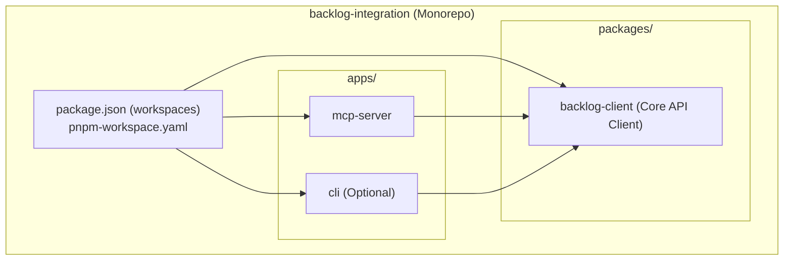
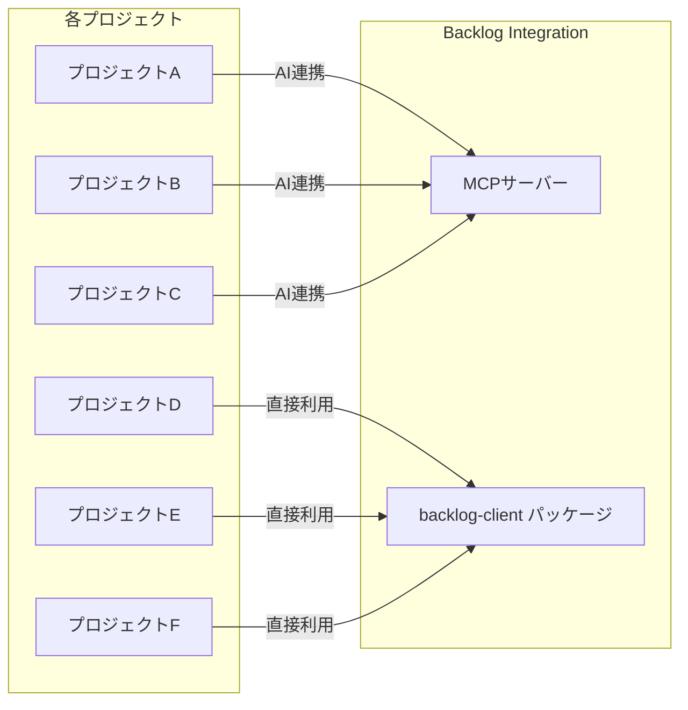

# 複数プロジェクトからBacklog連携を共通利用するためのアーキテクチャ設計

## 要件の整理

やりたいこと:

- BacklogからIssue（課題）を取得する
- 対応コメントを記載する
- レポーターへのアサイン変更を行う

これらを**複数のプロジェクト**から効率よく共通利用したい。

---

## アプローチ比較

| アプローチ | 概要 | メリット | デメリット | 推奨度 |
| :--- | :--- | :--- | :--- | :--- |
| **A. 共有npmパッケージ** | Backlog APIラッパーを独立パッケージとして切り出し、各プロジェクトが依存として利用 | バージョン管理が明確、言語非依存に近い | パッケージ公開・更新の手間 | ★★★★ |
| **B. モノレポ + Workspaces** | 全プロジェクトを1つのリポジトリに集約し、共通パッケージとして内部参照 | ローカル開発が楽、一括リファクタリング可能 | リポジトリが大きくなる、全プロジェクトが同一リポジトリ前提 | ★★★ |
| **C. MCPサーバー** | Backlog連携をMCPサーバーとして実装し、AIエージェント経由で全プロジェクトから利用 | AIワークフローとの統合が自然、プロジェクト側のコード変更不要 | MCPサーバーの運用が必要、プログラムからの直接呼び出しには不向き | ★★★★★ |
| **D. CLIツール** | Backlog操作をCLIツールとして実装し、各プロジェクトのスクリプトから呼び出す | シンプル、言語非依存 | GUI操作が必要な場合に不向き | ★★★ |
| **E. Git Submodule** | 共通コードをサブモジュールとして各プロジェクトに取り込む | 独立リポジトリのまま共有可能 | サブモジュール管理が煩雑 | ★★ |

---

## 推奨構成: ハイブリッド（MCPサーバー + 共有パッケージ）

最も効率的なのは、**用途に応じた2層構成**です。

### 構成図


```mermaid
graph TD
    subgraph "backlog-integration (Monorepo)"
        Root["package.json (workspaces)<br/>pnpm-workspace.yaml"]
        
        subgraph "packages/"
            Client["backlog-client (Core API Client)"]
        end
        
        subgraph "apps/"
            MCP["mcp-server"]
            CLI["cli (Optional)"]
        end
        
        Root --> Client
        Root --> MCP
        Root --> CLI
        MCP --> Client
        CLI --> Client
    end
```

各プロジェクトからの利用パターン:


```mermaid
flowchart LR
    subgraph Clients ["各プロジェクト"]
        PA[プロジェクトA]
        PB[プロジェクトB]
        PC[プロジェクトC]
        PD[プロジェクトD]
        PE[プロジェクトE]
        PF[プロジェクトF]
    end

    subgraph Integration ["Backlog Integration"]
        MCP[MCPサーバー]
        ClientPackage[backlog-client パッケージ]
    end

    PA & PB & PC -->|AI連携| MCP
    PD & PE & PF -->|直接利用| ClientPackage
```

---

## 各層の役割

### 1. `backlog-client`（コアパッケージ）

Backlog API v2のラッパーとして、以下の機能を提供:

```typescript
// 使用例
import { BacklogClient } from '@your-org/backlog-client';

const client = new BacklogClient({
  spaceId: 'your-space',
  apiKey: process.env.BACKLOG_API_KEY,
});

// 課題取得
const issue = await client.issues.get('PROJECT-123');

// コメント追加
await client.issues.addComment('PROJECT-123', {
  content: '対応しました。',
});

// 担当者をレポーターに変更
await client.issues.assignToReporter('PROJECT-123');
```

> [!TIP]
> Nulab公式の [`backlog-js`](https://www.npmjs.com/package/backlog-js) パッケージを内部で利用することで、APIの詳細を意識せずに済みます。

### 2. MCPサーバー

AIエージェント（Claude Desktop、Cursor、Cline等）から呼び出せるよう、MCPプロトコルでBacklog操作をツールとして公開:

ツールは次の 5 系統に分かれます。**最新の一覧は [README](../README.md) の「提供ツール」を参照してください**
（この表は系統ごとの代表例です）。

| 系統 | 代表的なツール | 役割 |
| :--- | :--- | :--- |
| 課題 | `get_issue` / `list_issues` / `count_issues` / `create_issue` / `update_issue` / `assign_to_reporter` | 課題の参照・作成・更新。`list_issues` は親課題・マイルストーン・期限日などで絞り込み、`offset` でページングする |
| コメント | `add_comment` / `get_comment` / `list_comments` / `count_comments` / `update_comment` / `delete_comment` | コメントの参照・投稿・修正 |
| 添付ファイル | `upload_attachment` / `list_issue_attachments` / `download_attachment` / `download_issue_attachments` / `delete_issue_attachment` | 添付の授受。`download_issue_attachments` は 1 回で全件保存する |
| メタ情報 | `get_project` / `list_project_users` / `list_milestones` / `list_statuses` / `list_issue_types` / `list_categories` / `list_priorities` / `get_myself` | 担当者・マイルストーン・カスタムステータスなどの ID を名前から引く（読み取り専用） |
| ドキュメント | `get_document` / `list_documents` / `get_document_tree` / `add_document` / `upload_document_markdown` / `download_document_markdown` | Backlog ドキュメントと Markdown の往復 |

設計上の約束事:

- 課題・コメントを返すツールは、接続中のスペースから組み立てた `url` を必ず含める
  （エージェントがスペース名を推測して誤った URL を書く事故を防ぐため）
- 更新系ツールは JSON を返し、人向けの要約は `message` フィールドに載せる
- `create_issue` / `update_issue` は課題種別・優先度・マイルストーン・カテゴリ・状態・担当者を
  ID でも名前でも受け付ける（サーバー側でメタ情報を引いて解決し、プロジェクト単位でキャッシュする）
- エラー返却には HTTP ステータスと Backlog API の `errors[].message`、対処方法を含める

> [!NOTE]
> 既存の [`nulab-backlog-mcp-server`](https://github.com/nulab/backlog-mcp-server) が公式で存在しますが、担当者をレポーターに変更するような複合操作は未対応の可能性があります。自前実装と公式MCPサーバーの併用も検討してください。

---

## 設定の共通化

各プロジェクトで異なるのは**BacklogのプロジェクトキーとspaceId**のみです。  
これを環境変数で管理することで、コードの変更なしに複数プロジェクトで利用可能にします。

```bash
# .env（各プロジェクトごとに配置）
BACKLOG_SPACE_ID=your-space
BACKLOG_API_KEY=your-api-key
BACKLOG_PROJECT_KEY=PROJECT_A
```

MCPサーバーの場合は、`mcp_settings.json`（または各ツールの設定ファイル）に設定:

```json
{
  "mcpServers": {
    "backlog": {
      "command": "npx",
      "args": ["-y", "@your-org/backlog-mcp-server"],
      "env": {
        "BACKLOG_SPACE_ID": "your-space",
        "BACKLOG_API_KEY": "your-api-key"
      }
    }
  }
}
```

> [!IMPORTANT]
> `BACKLOG_PROJECT_KEY` はMCPツールのパラメータとして毎回渡す設計にすると、1つのMCPサーバーインスタンスで複数プロジェクトを操作できます。

---

## どのアプローチを選ぶべきか？

### AIエージェントを活用する場合 → **MCPサーバー**

- Cursor / Claude Desktop / Cline などのAIエージェントから自然言語でBacklog操作ができる
- プロジェクト側にコード追加が不要
- 「PROJECT-123のコメントに対応済みと書いて、担当をレポーターに戻して」のような指示で操作可能

### CI/CDやスクリプトから利用する場合 → **共有パッケージ**

- GitHub Actionsなどから直接Backlog APIを呼びたい場合
- `npm install @your-org/backlog-client` で各プロジェクトに追加

### 両方使う場合 → **ハイブリッド構成（推奨）**

- コアパッケージ（`backlog-client`）を共通基盤として作成
- MCPサーバーもCLIもコアパッケージを利用
- ユースケースに応じて使い分けが可能

---

## まとめ

| 判断軸 | 推奨 |
| :--- | :--- |
| AI連携メイン | MCPサーバーのみ構築 |
| コードから呼び出しメイン | 共有パッケージのみ構築 |
| 両方使いたい | モノレポ内にコアパッケージ + MCPサーバー |
| プロジェクト間でリポジトリが完全分離 | npm公開 or GitHubレジストリ経由で共有パッケージを配布 |
| プロジェクトが同一組織内のみ | pnpm workspace でモノレポ管理 |
